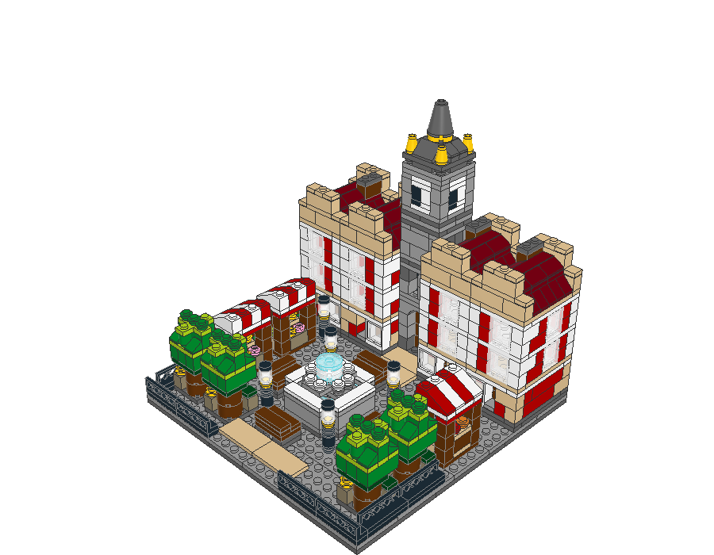
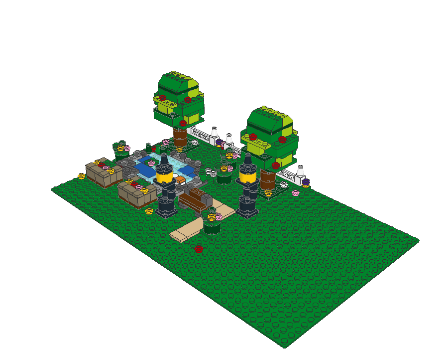
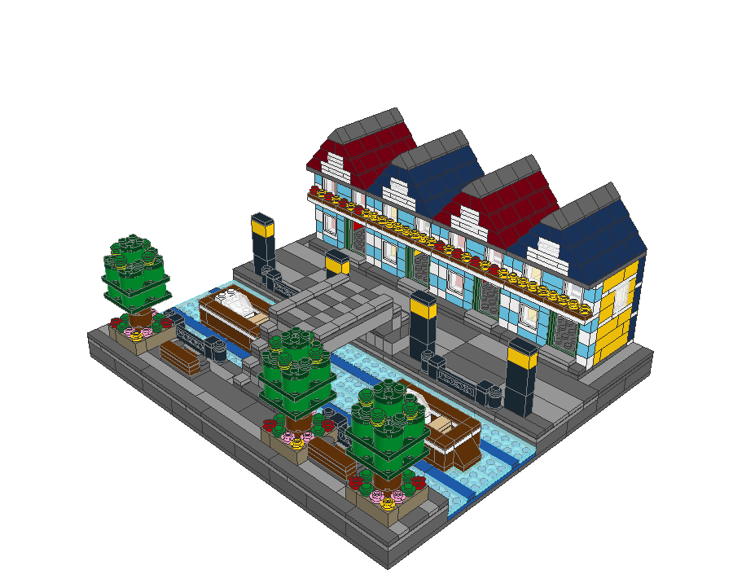
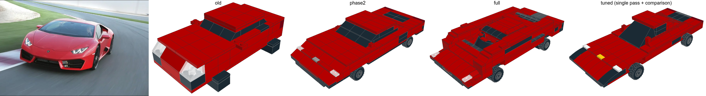
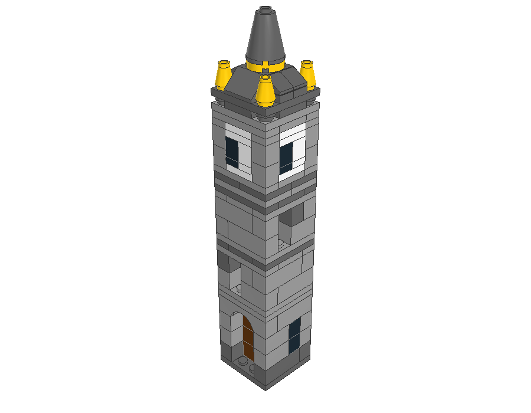

# BrickForge

Describe a model, or attach a photo, and BrickForge designs it in interlocking bricks that can really be built: every part sits on studs, nothing floats, and you get a 3D view, step-by-step instructions, a parts list and LDraw files for other brick-building software.

Claude (Anthropic's model) does the designing. BrickForge plans a large model as a tree of smaller sub-builds, reuses finished pieces from a growing component library, checks everything with its own validator, and sends the problems back to Claude until the model is valid.



> BrickForge is an independent project. It isn't affiliated with, sponsored by or endorsed by the LEGO Group; LEGO® is a trademark of the LEGO Group.

## Inspiration

This started from the Claude Opus 5.5 launch clip: [launch clip](LINK_TO_LAUNCH_CLIP) <!-- placeholder: add the link -->

## Screenshots

| | |
|---|---|
|  |  |
| A park scene on its baseplate (High detail, $0.68) | A canal street built mostly from library components ($1.12) |
|  |  |
| A sports car from a photo, next to the photo | A clock tower sub-build |

<!-- placeholder: a screenshot of the app (chat, 3D view and manual) goes here -->

The renders above are the exported models opened in [LeoCAD](https://www.leocad.org/).

## Getting started

### Desktop app

Download BrickForge for your system from the [Releases](https://github.com/HariGuns/brickforge/releases) page:

| System | File |
|---|---|
| Windows | `BrickForge-Setup-<version>.exe` (installer) or `BrickForge-<version>-portable.exe` (no install) |
| macOS (Apple silicon and Intel) | `BrickForge-<version>-universal.dmg` |
| Linux | `BrickForge-<version>-x86_64.AppImage` (`chmod +x` it, then run it) |

**Your API key.** On first launch a welcome screen asks for an [Anthropic API key](https://console.anthropic.com/). BrickForge checks it with a free API call and stores it only on your computer, in the app's data folder (on Linux and macOS the file is readable only by you). It's sent only to Anthropic. Change it any time with the gear button. No build of the app contains a key: the packaging script refuses to package anything that looks like one.

| System | Data folder (key, saved builds, runs, logs) |
|---|---|
| Windows | `%APPDATA%\BrickForge` |
| macOS | `~/Library/Application Support/BrickForge` |
| Linux | `~/.config/BrickForge` |

**Unsigned builds.** The app isn't code-signed, so your system warns you the first time you open it:
- **Windows (SmartScreen):** "Windows protected your PC" → **More info** → **Run anyway**.
- **macOS (Gatekeeper):** "BrickForge can't be opened because Apple cannot check it…". Open **System Settings → Privacy & Security**, scroll down and click **Open Anyway**. Alternatively, Control-click the app in Finder → **Open** → **Open**. If macOS says the app is "damaged", run `xattr -dr com.apple.quarantine /Applications/BrickForge.app` in Terminal.
- **Linux:** make the AppImage executable (`chmod +x BrickForge-*.AppImage`).

**Spending cap.** Each model has a cost (see below). In the app, set a cap with the **Cap** menu under the chat box. A run stops before any call that would go over the cap, and can be resumed with a higher one.

### From source

You need Node.js 22 or later and an Anthropic API key.

```bash
git clone https://github.com/HariGuns/brickforge.git
cd brickforge
npm install
cp .env.example .env.local     # then put your key in ANTHROPIC_API_KEY (never commit .env.local)
npm run dev                    # http://localhost:3000
```

From the command line:

```bash
npm run gen "a red fire truck"                                   # Standard detail, single pass
npm run gen -- --detail high "a medieval castle"                  # sub-builds
npm run gen -- --detail very_high --budget 10 "a town square"     # sub-build trees, $10 cap
npm run gen -- --image photo.jpg "a sports car"                   # from a photo
npm run gen -- --simulate "a town square"                         # simulated Claude: no API calls, no cost
```

**Budget cap:** every CLI run is capped at **$5** unless you pass `--budget <USD>`. When the cap would be crossed, the run stops before the next call, saves what's valid, writes `stopped.json` and prints the command to resume with a higher cap.

Results go to `exports/` (`.ldr` and `.mpd` for LDraw software) and a debug folder per run in `debug/` (every prompt, answer, validation result and its cost).

**Build the desktop app yourself:** `npm run dist` (this platform), or `npm run dist:linux` / `dist:win` / `dist:mac`. Release builds come from `.github/workflows/release.yml`, which tests, then builds all three platforms on a version tag (`v0.1.0`) and attaches them to a draft GitHub Release.

**Optional extras:**
- **BrickLink part numbers:** the wanted-list export uses Rebrickable's LDraw → BrickLink mapping. It isn't in the repo; fetch it with your own free [Rebrickable API key](https://rebrickable.com/api/): add `REBRICKABLE_API_KEY=…` to `.env.local` and run `npm run fetch-bricklink`. Without it, parts keep their LDraw numbers, which match BrickLink's for most parts.
- **Rebuilding the part catalog** (`npm run build-catalog`, `npm run verify-ldraw`) needs the LDraw parts library and the LDCad shadow library in `ldraw-lib/`; see [docs/ENGINEERING.md](docs/ENGINEERING.md).
- **LeoCAD** isn't needed for anything in the app. `scripts/leocad-render.sh` (Linux, Flatpak LeoCAD) renders exports for checking.
- **Simulated app:** `BRICKFORGE_SIMULATE=1` makes the app (or `npm run dev`) build the scripted town square with no API calls, for trying it out or testing a build.

## What a model costs

Real runs on Claude Opus 5.5, from the debug logs:

| Detail | How it's built | Typical cost | Examples |
|---|---|---|---|
| Standard | one design pass | $0.12–0.56 | small house $0.12–0.32, pickup $0.27–0.47, train $0.45–0.56 |
| High | sub-builds | $0.68–2.90 | park scene $0.68, steam train $1.13, village $2.57, castle (2,394 parts) $2.90 |
| Very high | sub-build trees | $1.12–2.93 | town square $2.28–2.93; canal street $1.12 with library reuse |
| From a photo | analysis, design, comparison with the photo | $1.02–2.86 | sports car $1.02–2.86 |

Reusing library components makes a model cheaper: the canal street reused 6 of its 8 sub-builds and cost $1.12 instead of about $2.80.

## How it works

```
request / photo
   │
   ▼
photo analysis ──► real size → target size in studs (photo builds only)
   │
   ▼
planner ──► sub-builds: envelope, part budget, copies, scene or object
   │          ├─ reuse from the component library (optionally recoloured)
   │          └─ split large ones into child sub-builds (up to 3 levels)
   ▼
sub-builds designed in parallel ──► each validated on its own, repaired until valid
   │
   ▼
assembly, deepest level first ──► copies placed, glue parts added, repaired until valid
   │
   ▼
compiler ──► expands copies into one model, checks joins at every level
   │
   ▼
validator ──► buildability, structure, wheels, side studs, baseplates
   │
   ▼
3D view · instruction manual (PDF) · parts list · BrickLink list · LDraw .ldr/.mpd
```

- **Planner** (`src/lib/claude/subbuilds.ts`, `tree.ts`): splits the model into sub-builds: repeated features (houses, trees, windows) or distinct sections (a tower, a hull). Copies are the main way to get a large, detailed model cheaply. Mirror-image copies cover left/right pairs, and sideways panels can be mounted on side studs. Scenes (a town square, a park) are marked as such and stand on a baseplate.
- **Sub-builds:** each is designed once, inside its own size envelope, and checked on its own. Before it's accepted, it's also test-placed on a baseplate and on a plate, as the assembly will place it, so a post standing on a single stud is widened while it's designed.
- **Component library** (`components/`, `src/lib/components/`): every valid sub-build is saved as a reusable component, with its size, connection points, tags and what it cost. Planners are offered matching components and reuse them instead of paying to design them again. 109 components ship with the repo; see [components/README.md](components/README.md).
- **Compiler** (`src/lib/design/compile.ts`): turns the tree of sub-builds and copies into one flat model (rotating and mirroring copies, up to 4 levels deep) and checks that every copy is attached, rests on something and doesn't interlock with a neighbour. About 60 ms for 4,600 parts.
- **Validator** (`src/lib/validate/`): the rules below. Its errors go back to Claude with a fix hint for each kind.
- **Part catalog:** 983 parts: 52 hand-made, 885 upright catalog parts, 41 side-stud parts and 5 baseplates. The catalog parts are generated from the LDraw parts library and the LDCad shadow library's connection data, and every one is checked against the real LDraw geometry (`npm run verify-ldraw`). The prompt lists a core menu of 150; Claude finds the rest with a `search_parts` tool.
- **Cost controls:** model and effort set per stage, a compact one-line-per-part answer format, repairs that return only the changes, prompt caching, and the per-model budget cap.

### Validator rules

A model is valid when none of these errors remain:

| Rule | Error |
|---|---|
| Every part and colour exists, inside the build area (48 × 48 studs) | `UNKNOWN_PART`, `UNKNOWN_COLOR`, `OUT_OF_BOUNDS` |
| No two parts share space (voxel check; exact check for sideways parts) | `OVERLAP` |
| Every part is clutched by studs to the main structure | `FLOATING`, `DISCONNECTED` |
| A part above the ground rests on studs below it; nothing hangs from above | `UNSUPPORTED` |
| No single stud holds a tall or heavy stack; overhangs are supported (structural estimate) | `WEAK_JOINT`, `OVERSTRESSED` |
| Wheels sit exactly on a free pin of their kind | `LOOSE_WHEEL`, `PIN_TAKEN` |
| Sideways panels clip onto real side studs | `MOUNT_INVALID`, `SIDEWAYS_DETACHED` |
| Baseplates lie flat on the ground, side by side; parts standing on one are joined through it, separate baseplates only through a bridging part | `BASEPLATE_NOT_ON_GROUND`, `OVERLAP` |
| Sub-build copies are attached, rest on something, and don't interlock | `DETACHED_SUBBUILD`, `SUBBUILD_UNSUPPORTED`, `INTERLOCKED` |

**Repair guard:** a repair must fix, not delete. Each repair round is compared with the first answer, and it counts as a failed repair (`FEATURE_REMOVED`) if any of these happen:
- copies of a planned sub-build are gone;
- a part type is gone completely (a clock face swapped for a plain brick);
- a sub-build lost more than 3 parts or more than 10% of its parts, whichever is smaller.

Claude is told to put the parts back and fix the problem in place. Every removal, accepted or rejected, is listed in the run's `summary.json`.

**Library gate:** a component is only saved if it's valid on its own, has no structural warnings, and still holds when placed on a baseplate and on a plate.

## Known limitations

- **Clock faces and other panels on side studs:** sideways mounting works, but in tests a repair once removed four sideways clock faces, and a later run built its clock faces flat into the wall. That case hasn't been re-tested since the repair guard was added.
- **Structure is an estimate, not physics:** weak joints and overhangs come from a mass-and-leverage estimate per joint. Balance, clutch strength and real loads aren't simulated.
- **Baseplate sizing:** a scene stands on the smallest baseplate that covers its whole footprint, so a few stray parts near the edge can make it pick a much bigger baseplate than the scene needs.
- **Parts:** no hinges, clips or pin-and-axle beams yet; slopes block their whole bounding box; parts can't hang from the underside of others.
- **Desktop builds are unsigned** (see above). The Windows build was tested under Wine: the app, key setup and a simulated build work; the installer's silent mode wasn't confirmed there.

More detail on all of this, with measurements, is in [docs/ENGINEERING.md](docs/ENGINEERING.md). The live test reports are in [docs/live-test-tree.md](docs/live-test-tree.md).

## How it was built

BrickForge was built with [Claude Code](https://www.anthropic.com/claude-code). I designed the system: the sub-build pipeline, the component library, the validator and repair rules, the testing approach and what to measure. Claude Code wrote the code under that direction, tested it against a simulated Claude first, and ran the live tests with a budget cap.

Developing and testing the sub-build system took **$41.57** of API calls (from the run logs, 24 September to 9 October 2026), including every test run.

## Licence

- **Code:** MIT; see [LICENSE](LICENSE).
- **Part data** (`src/lib/parts/catalog.json`, `public/parts/*.bin`): derived from the LDraw parts library (CC BY 2.0 / CC BY 4.0) and the LDCad shadow library (CC BY-SA 4.0), and shared under CC BY-SA 4.0; see [NOTICE.md](NOTICE.md).
